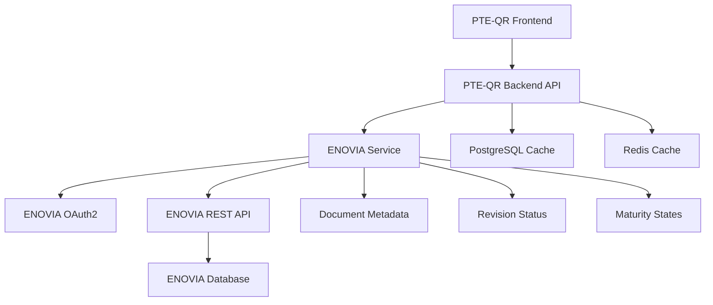

# Документация по интеграции с ENOVIA

## Содержание

1. [Обзор интеграции](#обзор-интеграции)
2. [Архитектура интеграции](#архитектура-интеграции)
3. [Настройка подключения](#настройка-подключения)
4. [API ENOVIA](#api-enovia)
5. [Аутентификация](#аутентификация)
6. [Работа с документами](#работа-с-документами)
7. [Маппинг статусов](#маппинг-статусов)
8. [Обработка ошибок](#обработка-ошибок)
9. [Мониторинг и логирование](#мониторинг-и-логирование)
10. [Тестирование интеграции](#тестирование-интеграции)
11. [Устранение неполадок](#устранение-неполадок)

## Обзор интеграции

Система PTE-QR интегрируется с ENOVIA PLM для получения актуальной информации о документах и их ревизиях. Интеграция обеспечивает:

- **Проверку актуальности** документов в реальном времени
- **Получение метаданных** документов и ревизий
- **Синхронизацию статусов** между ENOVIA и PTE-QR
- **Автоматическое обновление** информации о документах

### Поддерживаемые версии ENOVIA

- ENOVIA V6R2019x и выше
- 3DEXPERIENCE Platform 2020x и выше
- ENOVIA V6R2020x и выше

## Архитектура интеграции



### Компоненты интеграции

1. **ENOVIA Service** (`app/services/enovia_service.py`) - основной сервис интеграции
2. **ENOVIA Client** (`app/utils/enovia_client.py`) - клиент для работы с API
3. **Configuration** (`app/core/config.py`) - настройки подключения
4. **Health Check** - мониторинг состояния интеграции

## Настройка подключения

### 1. Получение учетных данных

Обратитесь к администратору ENOVIA для получения:

- **Base URL** - адрес экземпляра ENOVIA
- **Client ID** - идентификатор клиента OAuth2
- **Client Secret** - секретный ключ клиента
- **Scope** - разрешения для доступа к API

### 2. Настройка OAuth2 в ENOVIA

В административной панели ENOVIA создайте OAuth2 клиента:

```json
{
  "client_id": "pte-qr-client",
  "client_secret": "your-secret-key",
  "grant_types": ["client_credentials"],
  "scope": "read documents revisions",
  "redirect_uris": [],
  "access_token_validity": 3600,
  "refresh_token_validity": 7200
}
```

### 3. Конфигурация PTE-QR

Обновите файл `backend/.env`:

```env
# ENOVIA Integration
ENOVIA_BASE_URL=https://your-enovia-instance.com
ENOVIA_CLIENT_ID=your_client_id
ENOVIA_CLIENT_SECRET=your_client_secret
ENOVIA_SCOPE=read documents revisions
```

### 4. Проверка подключения

```bash
# Проверка доступности ENOVIA
curl -I https://your-enovia-instance.com

# Тестирование OAuth2
curl -X POST https://your-enovia-instance.com/oauth2/token \
  -H "Content-Type: application/x-www-form-urlencoded" \
  -d "grant_type=client_credentials&client_id=your_client_id&client_secret=your_client_secret&scope=read"
```

## API ENOVIA

### Базовые эндпоинты

| Эндпоинт | Метод | Описание |
|----------|-------|----------|
| `/oauth2/token` | POST | Получение токена доступа |
| `/api/v1/documents/{doc_uid}` | GET | Получение метаданных документа |
| `/api/v1/documents/{doc_uid}/revisions/{revision}` | GET | Получение метаданных ревизии |
| `/api/v1/documents/{doc_uid}/revisions/latest` | GET | Получение последней ревизии |
| `/api/v1/health` | GET | Проверка состояния API |

### Структура данных документа

```json
{
  "id": "string",
  "title": "string",
  "number": "string",
  "type": "string",
  "createdAt": "2024-01-15T10:30:00Z",
  "updatedAt": "2024-01-15T10:30:00Z"
}
```

### Структура данных ревизии

```json
{
  "id": "string",
  "revision": "string",
  "maturityState": "Released|AFC|Accepted|Approved|Obsolete|Superseded|In Work|Frozen",
  "releasedDate": "2024-01-15T10:30:00Z",
  "supersededBy": "string|null",
  "lastModified": "2024-01-15T10:30:00Z",
  "pages": 10
}
```

## Аутентификация

### OAuth2 Client Credentials Flow

```python
async def _get_access_token(self) -> str:
    """Получение токена доступа OAuth2"""
    response = await client.post(
        f"{self.base_url}/oauth2/token",
        data={
            "grant_type": "client_credentials",
            "client_id": self.client_id,
            "client_secret": self.client_secret,
            "scope": "read",
        },
        timeout=30.0,
    )
    
    token_data = response.json()
    self.access_token = token_data["access_token"]
    expires_in = token_data.get("expires_in", 3600)
    self.token_expires_at = datetime.now().timestamp() + expires_in - 60
```

### Управление токенами

- **Автоматическое обновление** - токены обновляются автоматически
- **Кэширование** - токены кэшируются в памяти
- **Обработка ошибок** - автоматический retry при истечении токена

## Работа с документами

### Получение метаданных документа

```python
async def get_document_meta(self, doc_uid: str) -> Optional[Dict[str, Any]]:
    """Получение метаданных документа из ENOVIA"""
    data = await self._make_request("GET", f"/api/v1/documents/{doc_uid}")
    
    return {
        "id": data.get("id"),
        "title": data.get("title"),
        "number": data.get("number"),
        "type": data.get("type"),
        "created_at": data.get("createdAt"),
        "updated_at": data.get("updatedAt"),
    }
```

### Получение метаданных ревизии

```python
async def get_revision_meta(self, doc_uid: str, revision: str) -> Optional[Dict[str, Any]]:
    """Получение метаданных ревизии из ENOVIA"""
    data = await self._make_request(
        "GET", f"/api/v1/documents/{doc_uid}/revisions/{revision}"
    )
    
    return {
        "id": data.get("id"),
        "revision": data.get("revision"),
        "maturityState": data.get("maturityState"),
        "releasedDate": data.get("releasedDate"),
        "supersededBy": data.get("supersededBy"),
        "lastModified": data.get("lastModified"),
        "pages": data.get("pages", 1),
    }
```

### Получение последней ревизии

```python
async def get_latest_released(self, doc_uid: str) -> Optional[Dict[str, Any]]:
    """Получение последней выпущенной ревизии из ENOVIA"""
    data = await self._make_request(
        "GET", f"/api/v1/documents/{doc_uid}/revisions/latest"
    )
    
    return {
        "id": data.get("id"),
        "revision": data.get("revision"),
        "maturityState": data.get("maturityState"),
        "releasedDate": data.get("releasedDate"),
        "lastModified": data.get("lastModified"),
    }
```

## Маппинг статусов

### ENOVIA → PTE-QR

| ENOVIA State | PTE-QR Business Status | Описание |
|--------------|------------------------|----------|
| `Released` | `APPROVED_FOR_CONSTRUCTION` | Утвержден для строительства |
| `AFC` | `APPROVED_FOR_CONSTRUCTION` | Утвержден для строительства |
| `Accepted` | `ACCEPTED_BY_CUSTOMER` | Принят заказчиком |
| `Approved` | `ACCEPTED_BY_CUSTOMER` | Принят заказчиком |
| `Obsolete` | `CHANGES_INTRODUCED_GET_NEW` | Изменения внесены, получить новую версию |
| `Superseded` | `CHANGES_INTRODUCED_GET_NEW` | Изменения внесены, получить новую версию |
| `In Work` | `IN_WORK` | В работе |
| `Frozen` | `IN_WORK` | В работе |

### Проверка актуальности ревизии

```python
def is_revision_actual(self, revision_data: Dict[str, Any]) -> bool:
    """Проверка актуальности ревизии"""
    maturity_state = revision_data.get("maturityState", "")
    superseded_by = revision_data.get("supersededBy")
    
    # Ревизия актуальна, если она выпущена и не заменена
    return (
        maturity_state in ["Released", "AFC", "Accepted", "Approved"]
        and not superseded_by
    )
```

## Обработка ошибок

### Типы ошибок

1. **Ошибки аутентификации** (401, 403)
2. **Ошибки ресурсов** (404, 410)
3. **Ошибки сервера** (500, 502, 503)
4. **Ошибки сети** (timeout, connection refused)
5. **Ошибки валидации** (400, 422)

### Стратегии обработки

```python
async def _make_request(self, method: str, endpoint: str, **kwargs) -> Dict[str, Any]:
    """Выполнение запроса с обработкой ошибок"""
    try:
        token = await self._get_access_token()
        headers = {
            "Authorization": f"Bearer {token}",
            "Content-Type": "application/json",
            **kwargs.get("headers", {}),
        }
        
        async with httpx.AsyncClient() as client:
            response = await client.request(
                method, f"{self.base_url}{endpoint}", 
                timeout=30.0, **kwargs
            )
            response.raise_for_status()
            return response.json()
            
    except httpx.HTTPStatusError as e:
        logger.error(
            "ENOVIA API error",
            method=method,
            endpoint=endpoint,
            status_code=e.response.status_code,
            response=e.response.text,
        )
        raise
    except Exception as e:
        logger.error(
            "ENOVIA request failed", 
            method=method, 
            endpoint=endpoint, 
            error=str(e)
        )
        raise
```

### Retry механизм

```python
import asyncio
from tenacity import retry, stop_after_attempt, wait_exponential

@retry(
    stop=stop_after_attempt(3),
    wait=wait_exponential(multiplier=1, min=4, max=10)
)
async def _make_request_with_retry(self, method: str, endpoint: str, **kwargs):
    """Запрос с автоматическими повторами"""
    return await self._make_request(method, endpoint, **kwargs)
```

## Мониторинг и логирование

### Health Check

```python
async def health_check(self) -> Dict[str, Any]:
    """Проверка состояния ENOVIA сервиса"""
    try:
        await self._make_request("GET", "/api/v1/health")
        return {
            "enovia": "healthy", 
            "last_check": datetime.now().isoformat()
        }
    except Exception as e:
        logger.error("ENOVIA health check failed", error=str(e))
        return {
            "enovia": "unhealthy",
            "error": str(e),
            "last_check": datetime.now().isoformat(),
        }
```

### Метрики

- **Количество запросов** к ENOVIA API
- **Время ответа** API
- **Количество ошибок** по типам
- **Статус токенов** аутентификации
- **Кэш-хиты** и кэш-миссы

### Логирование

```python
import structlog

logger = structlog.get_logger()

# Успешные запросы
logger.info(
    "ENOVIA request successful",
    method="GET",
    endpoint="/api/v1/documents/123",
    duration=0.5
)

# Ошибки
logger.error(
    "ENOVIA request failed",
    method="GET",
    endpoint="/api/v1/documents/123",
    error="Document not found",
    status_code=404
)
```

## Тестирование интеграции

### Unit тесты

```python
import pytest
from unittest.mock import AsyncMock, patch
from app.services.enovia_service import ENOVIAClient

@pytest.mark.asyncio
async def test_get_document_meta():
    """Тест получения метаданных документа"""
    client = ENOVIAClient()
    
    with patch.object(client, '_make_request') as mock_request:
        mock_request.return_value = {
            "id": "123",
            "title": "Test Document",
            "number": "DOC-001",
            "type": "Drawing"
        }
        
        result = await client.get_document_meta("123")
        
        assert result["id"] == "123"
        assert result["title"] == "Test Document"
        mock_request.assert_called_once_with("GET", "/api/v1/documents/123")
```

### Integration тесты

```python
@pytest.mark.asyncio
async def test_enovia_integration():
    """Тест интеграции с ENOVIA"""
    client = ENOVIAClient()
    
    # Тест получения токена
    token = await client._get_access_token()
    assert token is not None
    
    # Тест получения документа
    doc_meta = await client.get_document_meta("test-doc-123")
    assert doc_meta is not None
```

### Тестирование в Docker

```bash
# Запуск тестов интеграции
docker-compose exec backend pytest tests/test_enovia_integration.py -v

# Тестирование с реальным ENOVIA
ENOVIA_BASE_URL=https://test-enovia.com docker-compose exec backend pytest tests/test_enovia_integration.py -v
```

## Устранение неполадок

### Проблемы с аутентификацией

**Ошибка "Invalid client credentials":**
```bash
# Проверка учетных данных
curl -X POST https://your-enovia-instance.com/oauth2/token \
  -H "Content-Type: application/x-www-form-urlencoded" \
  -d "grant_type=client_credentials&client_id=your_client_id&client_secret=your_client_secret"
```

**Ошибка "Token expired":**
- Проверьте настройки `expires_in` в ENOVIA
- Убедитесь, что система времени синхронизирована

### Проблемы с API

**Ошибка 404 "Document not found":**
```bash
# Проверка существования документа
curl -H "Authorization: Bearer YOUR_TOKEN" \
  https://your-enovia-instance.com/api/v1/documents/DOC-123
```

**Ошибка 403 "Forbidden":**
- Проверьте scope разрешений в OAuth2 клиенте
- Убедитесь, что у клиента есть доступ к документам

### Проблемы с производительностью

**Медленные запросы:**
```bash
# Проверка времени ответа
time curl -H "Authorization: Bearer YOUR_TOKEN" \
  https://your-enovia-instance.com/api/v1/health
```

**Таймауты:**
- Увеличьте `timeout` в настройках
- Проверьте сетевое подключение к ENOVIA

### Проблемы с кэшированием

**Устаревшие данные:**
```bash
# Очистка кэша Redis
docker-compose exec redis redis-cli FLUSHALL

# Перезапуск сервиса
docker-compose restart backend
```

### Диагностика

```bash
# Проверка логов ENOVIA сервиса
docker-compose logs backend | grep -i enovia

# Проверка метрик
curl http://localhost:8000/api/v1/health

# Проверка состояния интеграции
curl http://localhost:8000/api/v1/health/detailed
```

## Конфигурация для продакшена

### Безопасность

```env
# Использование переменных окружения
ENOVIA_BASE_URL=${ENOVIA_BASE_URL}
ENOVIA_CLIENT_ID=${ENOVIA_CLIENT_ID}
ENOVIA_CLIENT_SECRET=${ENOVIA_CLIENT_SECRET}

# Ротация секретов
ENOVIA_CLIENT_SECRET_ROTATION_ENABLED=true
ENOVIA_TOKEN_CACHE_TTL=3000
```

### Мониторинг

```yaml
# Prometheus метрики
enovia_requests_total{method="GET",endpoint="/api/v1/documents",status="200"} 150
enovia_request_duration_seconds{method="GET",endpoint="/api/v1/documents"} 0.5
enovia_token_refreshes_total{status="success"} 25
```

### Алерты

```yaml
# Grafana алерты
- alert: ENOVIAIntegrationDown
  expr: enovia_health_check == 0
  for: 5m
  labels:
    severity: critical
  annotations:
    summary: "ENOVIA integration is down"
    description: "ENOVIA API has been unreachable for more than 5 minutes"
```

---

*Версия документации: 1.0*  
*Дата обновления: 2024*
